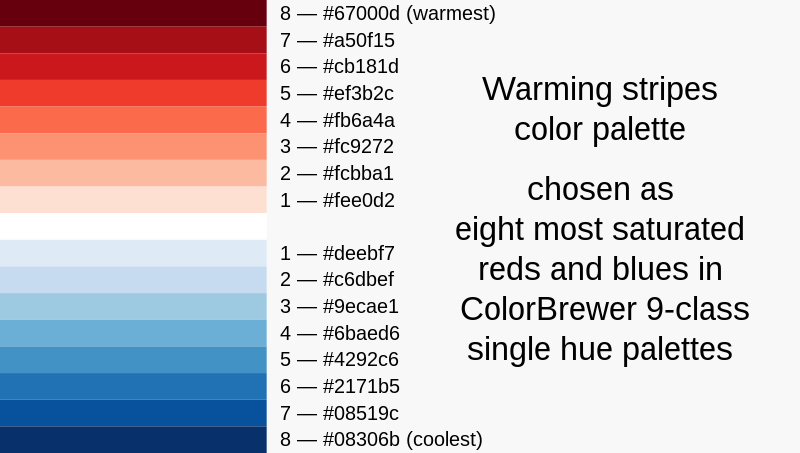

In this document, I will make the warming stripes to visualise the [hadisst](https://www.metoffice.gov.uk/hadobs/hadisst/data/download.html) sea surface temperature anomaly in the central and southern North Sea (ICES divisions 4bc). The data used in this documented is the aggregated temperature - mean of all grids within the boundary of central and southern North Sea.

The warming strip is created by [Ed Hawkins in 2018](https://twitter.com/ed_hawkins/status/999242147135188993) to visualise the climate warming. The concept is also extended to visualise other aspects - see [wikipedia](https://en.wikipedia.org/wiki/Warming_stripes).

[](https://twitter.com/ed_hawkins/status/999242147135188993)

The [stripes](https://twitter.com/maxnoethe/status/1176398931208671232) come from 8 most saturated [blues](https://colorbrewer2.org/#type=sequential&scheme=Blues&n=9) and [reds](https://colorbrewer2.org/#type=sequential&scheme=Reds&n=9) from the ColorBrewer 9-class single hue palettes.

[](https://en.m.wikipedia.org/wiki/File:20180522_Color_palette_for_warming_stripes_-_ColorBrewer_9-class_single_hue.svg)

# setup

**load packages**

```{r message=FALSE, warning=FALSE}
library(tidyverse)    # process data
library(lubridate)    # process date-time
library(RColorBrewer) # color palette
library(scales)       # check color 
```

**load data**

```{r}
# dataframe
hadisst <- read_rds(file.path("./data", "hadisst_ices.rds"))
head(hadisst)
```

Process the hadisst temperature data to:

-   get the annual mean temperature (temp) as hadisst is monthly data

-   get the temperature anomaly (variation from the average temperature over the period)

-   convert Year to date

```{r message=FALSE, warning=FALSE}
hadisst_year <- hadisst %>%
  group_by(IcesArea, Year) %>%
  summarize(temp = mean(hadisst_degC)) %>%
  group_by(IcesArea) %>%
  mutate(c.temp = as.numeric(scale(temp, scale = F))) %>%
  mutate(date = ymd(str_c(Year, "01-01", sep = "-")))
```

# create the stripes

create ggplot theme

```{r}
theme_stripe <- theme_minimal()+
                 theme(axis.text.y = element_blank(),
                       axis.line.y = element_blank(),
                       axis.title = element_blank(),
                       panel.grid.major = element_blank(),
                       legend.title = element_blank(),
                       axis.text.x = element_text(vjust = 3),
                       panel.grid.minor = element_blank(),
                       plot.title = element_text(size = 14, face = "bold"),
                       plot.subtitle = element_text(size = 8),
                       legend.position = "bottom",
                       legend.text = element_text(size = 8)
                       )
```

create color palette

```{r}
stripe_red <- brewer.pal(9, "Reds")[2:9]
stripe_blue <- brewer.pal(9, "Blues")[2:9]
col_stripe <- c(rev(stripe_blue), stripe_red)

# check if the color palette is correct
scales::show_col(col_stripe)
```

# plot

```{r}
## setup legend break
range(hadisst_year$c.temp) #-1.4 - 1.6
limits = c(-1.6, 1.6)
breaks = c(-1.6, -1, -0.5, 0, 0.5, 1, 1.6)


## plot
ggplot(hadisst_year %>% filter(IcesArea == "4bc"),
             aes(x = date, y = 1, fill = c.temp)) +
        geom_tile() +
           scale_x_date(date_breaks = "30 years",
                     date_labels = "%Y",
                     expand = c(0, 0)) +
           scale_y_continuous(expand = c(0, 0)) +
           scale_fill_gradientn(colors = col_stripe,
                                limits= limits,
                                breaks = breaks) +
            guides(fill = guide_colorbar(barheight = 0.5, barwidth = 10)) +
            labs(title = "Central and Southern North Sea | 1870-2021",
                 subtitle = "Data: Hadley Centre Sea Ice and Sea Surface Temperature Analysis")+
              theme_stripe  
  
## save image
ggsave(
  filename = "23.12.03_visualisation_warming-stripes.png",
  plot = last_plot(), 
  width = 12, 
  height = 6, 
  units = "cm", 
  dpi = 600
  )
```

# reference

-   <https://dominicroye.github.io/en/2018/how-to-create-warming-stripes-in-r/>
